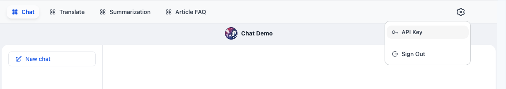
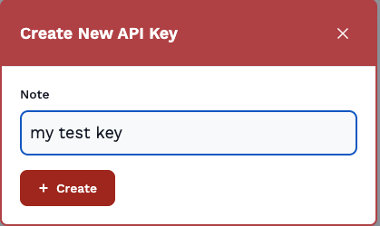
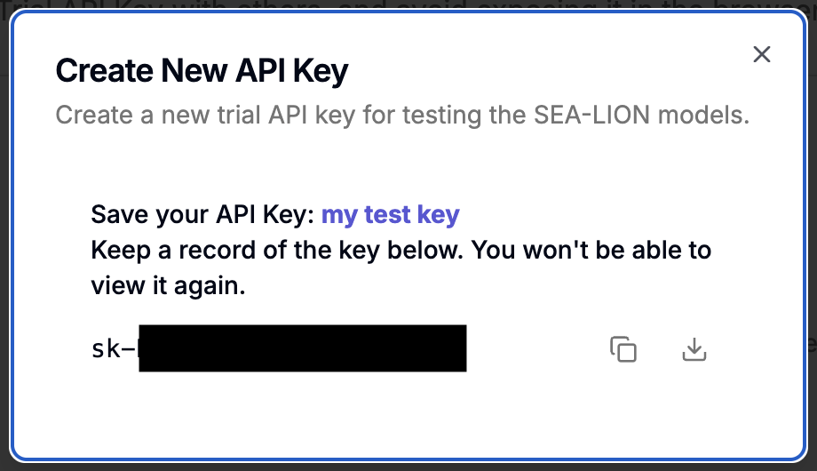

# SEA-LION API

The SEA-LION API provides a quick and simple interface to our various SEA-LION models for text generation, translation, summarization, and more.

Usage of the SEA-LION API is subject to our [Terms of Use](https://sea-lion.ai/terms-of-use/) and [Privacy Policy](https://sea-lion.ai/privacy-policy/)

## Getting an API Key

To get started with SEA-LION API, you'll need to first create an API key via our [SEA-LION Playground](https://playground.sea-lion.ai/):

1. Sign in to SEA-LION Playground via your Google account

2. Navigate to our API Key Manager page by clicking on

- `API Key` on the side menu, or
- `Launch Key Manager` on the home dashboard

<figure></figure>

3. Click on the "Create New Trial API Key" button, and enter a name for your API key.

<!--  -->
<figure></figure>

An API key will be generated for you after you click "Create". **Make sure to copy or download the generated key** and keep it in a safe place since you won't be able to view it again.

<!--  -->
<figure></figure>

Only 1 API key is allowed to be created per user.

## How To Use Your API Key

### Step 1. Find the Available Models

To find the available SEA-LION models for your API key, use the following curl command.

```
curl 'https://api.sea-lion.ai/v1/models' \
  -H 'Authorization: Bearer YOUR_API_KEY'
```

Replace YOUR_API_KEY with your generated API key.

### Step 2: Call the API

SEA-LION's API endpoints for chat are compatible with OpenAI's API and libraries.

#### Calling our Instruct models




```
curl https://api.sea-lion.ai/v1/chat/completions \
  -H 'accept: text/plain' \
  -H 'Authorization: Bearer YOUR_API_KEY' \
  -H 'Content-Type: application/json' \
  -d '{
    "model": "aisingapore/Qwen-SEA-LION-v4.5-27B-IT",
    "messages": [
      {
        "role": "user",
        "content": "Tell me a Singlish joke!"
      }
    ]
  }'
```





```python
from openai import OpenAI

client = OpenAI(
    api_key=YOUR_API_KEY,
    base_url="https://api.sea-lion.ai/v1"
)

completion = client.chat.completions.create(
    model="aisingapore/Qwen-SEA-LION-v4.5-27B-IT",
    messages=[
        {
            "role": "user",
            "content": "Tell me a Singlish joke!"
        }
    ]
)

print(completion.choices[0].message.content)
```




#### Agentic Tool Use

The SEA-LION v4.5 model supports function calling, enabling agentic workflows where the model autonomously decides which tools to call, processes results, and continues until the task is complete.




```python
from openai import OpenAI
import json

client = OpenAI(
    api_key=YOUR_API_KEY,
    base_url="https://api.sea-lion.ai/v1"
)

tools = [
    {
        "type": "function",
        "function": {
            "name": "get_weather",
            "description": "Get the current weather for a city",
            "parameters": {
                "type": "object",
                "properties": {
                    "city": {"type": "string", "description": "The city name"}
                },
                "required": ["city"]
            }
        }
    }
]

def get_weather(city):
    # Replace with a real weather API call
    mock_data = {"Singapore": "32°C, humid", "Jakarta": "30°C, cloudy"}
    return mock_data.get(city, "Weather data unavailable")

messages = [{"role": "user", "content": "What is the weather in Singapore and Jakarta?"}]

# Agentic loop: runs until the model stops calling tools
while True:
    response = client.chat.completions.create(
        model="aisingapore/Qwen-SEA-LION-v4.5-27B-IT",
        messages=messages,
        tools=tools,
        tool_choice="auto"
    )
    msg = response.choices[0].message
    messages.append(msg)

    if response.choices[0].finish_reason == "tool_calls":
        for tc in msg.tool_calls:
            args = json.loads(tc.function.arguments)
            result = get_weather(args["city"])
            messages.append({"role": "tool", "tool_call_id": tc.id, "content": result})
    else:
        print(msg.content)
        break
```




#### Calling our Reasoning models

Our v3.5 models offers dynamic reasoning capabilities, and defaults to reasoning with `thinking_mode="on"` passed to the chat template. To use non-thinking mode ie. standard generations, pass `thinking_mode="off"` to the chat template instead.




```
curl https://api.sea-lion.ai/v1/chat/completions \
  -H 'accept: text/plain' \
  -H 'Authorization: Bearer YOUR_API_KEY' \
  -H 'Content-Type: application/json' \
  -d '{
    "model": "aisingapore/Llama-SEA-LION-v3.5-70B-R",
    "messages": [
      {
        "role": "user",
        "content": "Tell me a Singlish joke!"
      }
    ],
    "chat_template_kwargs": {
	    "thinking_mode": "off"
    }
  }'
```





```python
from openai import OpenAI

client = OpenAI(
    api_key=YOUR_API_KEY,
    base_url="https://api.sea-lion.ai/v1"
)

completion = client.chat.completions.create(
    model="aisingapore/Llama-SEA-LION-v3.5-70B-R",
    messages=[
        {
            "role": "user",
            "content": "Tell me a Singlish joke!"
        }
    ],
    extra_body={
        "chat_template_kwargs": {
            "thinking_mode": "off"
        }
    },
)

print(completion.choices[0].message.content)
```





If you are not observing any changes in response when toggling `thinking_mode` on/off, your API responses might have been cached.

You can disable cache temporarily for your testing by setting the `no-cache` flag to `true`




```
curl https://api.sea-lion.ai/v1/chat/completions \
  -H 'accept: text/plain' \
  -H 'Authorization: Bearer YOUR_API_KEY' \
  -H 'Content-Type: application/json' \
  -d '{
    "model": "aisingapore/Llama-SEA-LION-v3.5-70B-R",
    "messages": [
      {
        "role": "user",
        "content": "Tell me a Singlish joke!"
      }
    ],
    "chat_template_kwargs": {
	    "thinking_mode": "off"
    },
    "cache": {
      "no-cache": true
    }
  }'
```





```python
from openai import OpenAI

client = OpenAI(
    api_key=YOUR_API_KEY,
    base_url="https://api.sea-lion.ai/v1"
)

completion = client.chat.completions.create(
    model="aisingapore/Llama-SEA-LION-v3.5-70B-R",
    messages=[
        {
            "role": "user",
            "content": "Tell me a Singlish joke!"
        }
    ],
    extra_body={
        "chat_template_kwargs": {
            "thinking_mode": "off"
        },
        "cache": {
            "no-cache": True
        }
    },
)

print(completion.choices[0].message.content)
```






#### Calling our Guard model

Our safety model, `aisingapore/SEA-Guard`, can be used to evaluate potentially harmful content. It returns a binary classification of `safe` and `unsafe`, and supports 3 flexible input modes, depending on your use case.



Note: The safety model **does not** support system prompts or multi-turn conversations.



**Mode 1: Prompt-only Classification**




```
curl https://api.sea-lion.ai/v1/chat/completions \
  -H 'accept: text/plain' \
  -H 'Authorization: Bearer YOUR_API_KEY' \
  -H 'Content-Type: application/json' \
  -d '{
  "messages": [
    {
      "role": "user",
      "content": {PROMPT}
    }
  ],
  "model": "aisingapore/SEA-Guard",
  "stream": false
}'
```





```python
from openai import OpenAI

client = OpenAI(
    api_key=YOUR_API_KEY,
    base_url="https://api.sea-lion.ai/v1"
)

completion = client.chat.completions.create(
    model="aisingapore/SEA-Guard",
    messages=[
        {
            "role": "user",
            "content": {PROMPT}
        }
    ],
)

print(completion.choices[0].message.content)
```




**Mode 2: Prompt + Response Classification**




```
curl https://api.sea-lion.ai/v1/chat/completions \
  -H 'accept: text/plain' \
  -H 'Authorization: Bearer YOUR_API_KEY' \
  -H 'Content-Type: application/json' \
  -d '{
  "messages": [
    {
      "role": "user",
      "content": "Human user:{PROMPT}\nAI assistant:{RESPONSE}."
    }
  ],
  "model": "aisingapore/SEA-Guard",
  "stream": false
}'
```





```python
from openai import OpenAI

client = OpenAI(
    api_key=YOUR_API_KEY,
    base_url="https://api.sea-lion.ai/v1"
)

completion = client.chat.completions.create(
    model="aisingapore/SEA-Guard",
    messages=[
        {
            "role": "user",
            "content": "Human user:{PROMPT}\nAI assistant:{RESPONSE}."
        }
    ],
)

print(completion.choices[0].message.content)
```




**Mode 3: Response-only Classification**




```
curl https://api.sea-lion.ai/v1/chat/completions \
  -H 'accept: text/plain' \
  -H 'Authorization: Bearer YOUR_API_KEY' \
  -H 'Content-Type: application/json' \
  -d '{
  "messages": [
    {
      "role": "user",
      "content": "Human user:\nAI assistant:{RESPONSE}."
    }
  ],
  "model": "aisingapore/SEA-Guard",
  "stream": false
}'
```





```python
from openai import OpenAI

client = OpenAI(
    api_key=YOUR_API_KEY,
    base_url="https://api.sea-lion.ai/v1"
)

completion = client.chat.completions.create(
    model="aisingapore/SEA-Guard",
    messages=[
        {
            "role": "user",
            "content": "Human user:\nAI assistant:{RESPONSE}."
        }
    ],
)

print(completion.choices[0].message.content)
```




#### Calling our Embedding models

[SEA-LION-ModernBERT-Embedding-600M](https://huggingface.co/aisingapore/SEA-LION-ModernBERT-Embedding-600M) produces 1024-dimensional embeddings and supports 11 Southeast Asian languages with an 8k token context window.



```
curl https://api.sea-lion.ai/v1/embeddings \
  -H 'Authorization: Bearer YOUR_API_KEY' \
  -H 'Content-Type: application/json' \
  -d '{
    "model": "aisingapore/SEA-LION-ModernBERT-Embedding-600M",
    "input": [
      "Singapore is a tropical island city-state.",
      "The Lion City sits at the tip of the Malay Peninsula."
    ]
  }'
```



```python
import requests

response = requests.post(
    "https://api.sea-lion.ai/v1/embeddings",
    headers={
        "Authorization": f"Bearer {YOUR_API_KEY}",
        "Content-Type": "application/json"
    },
    json={
        "model": "aisingapore/SEA-LION-ModernBERT-Embedding-600M",
        "input": [
            "Singapore is a tropical island city-state.",
            "The Lion City sits at the tip of the Malay Peninsula."
        ]
    }
)

response.raise_for_status()
embeddings = [item["embedding"] for item in response.json()["data"]]
print(f"Number of embeddings: {len(embeddings)}")
print(f"Embedding dimension: {len(embeddings[0])}")
```



#### Sentence Similarity

Embeddings can be used to measure semantic similarity between sentences using cosine similarity.



```python
import math
import requests

def get_embeddings(texts, api_key):
    response = requests.post(
        "https://api.sea-lion.ai/v1/embeddings",
        headers={
            "Authorization": f"Bearer {api_key}",
            "Content-Type": "application/json"
        },
        json={"model": "aisingapore/SEA-LION-ModernBERT-Embedding-600M", "input": texts}
    )
    response.raise_for_status()
    return [item["embedding"] for item in response.json()["data"]]

def cosine_similarity(a, b):
    dot = sum(x * y for x, y in zip(a, b))
    norm_a = math.sqrt(sum(x ** 2 for x in a))
    norm_b = math.sqrt(sum(x ** 2 for x in b))
    return dot / (norm_a * norm_b)

api_key = YOUR_API_KEY

sentences = [
    "The food in Singapore is delicious.",
    "Singapore has amazing cuisine.",
    "The weather today is very hot.",
]

embeddings = get_embeddings(sentences, api_key)

for i in range(len(sentences)):
    for j in range(i + 1, len(sentences)):
        sim = cosine_similarity(embeddings[i], embeddings[j])
        print(f"[{i}] vs [{j}] similarity: {sim:.4f}")
        print(f"  '{sentences[i]}'")
        print(f"  '{sentences[j]}'")
```



Sentences with similar meaning (e.g. food-related) score higher (≈0.95) than unrelated ones (≈0.63–0.65).

## Rate Limits

Limits help us mitigate misuse and manage API capacity and help ensure that everyone has fair access to the API.

SEA-LION API usage frequency will be subject to rate limits applied on requests per minute (RPM).

As of 04 Jun 2026, our rate limits is set to **10 requests per minute per user**.

If you have any questions or want to speak about getting a rate limit increase, reach out to sealion@aisingapore.org.
