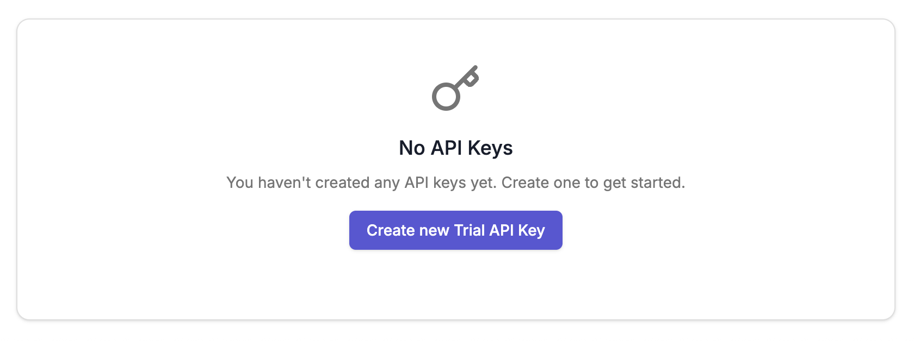

# SEA-LION API


The SEA-LION API provides a quick and simple interface to our various SEA-LION models for text generation, translation, summarization, and more. 

Usage of the SEA-LION API is subject to our [Terms of Use](https://sea-lion.ai/terms-of-use/) and [Privacy Policy](https://sea-lion.ai/privacy-policy/)

### Getting an API Key

To get started with SEA-LION API, you'll need to first create an API key via our [SEA-LION Playground](https://playground.sea-lion.ai/):

1. Sign in to SEA-LION Playground via your Google account

2. Navigate to our API Key Manager page by clicking on
 - `API Key` on the side menu, or
 - `Launch Key Manager` on the home dashboard


3. Click on the "Create New Trial API Key" button, and enter a name for your API key.



An API key will be generated for you after you click "Create". **Make sure to copy or download the generated key** and keep it in a safe place since you won't be able to view it again. 


Only 1 API key is allowed to be created per user.

### How To Use Your API Key

#### Step 1. Find the Available Models

To find the available SEA-LION models for your API key, use the following curl command.

```
curl 'https://api.sea-lion.ai/v1/models' \
  -H 'Authorization: Bearer YOUR_API_KEY'
```
Replace YOUR_API_KEY with your generated API key.

#### Step 2: Call the API

SEA-LION's API endpoints for chat are compatible with OpenAI's API and libraries.

### Calling our Instruct models


 
```
curl https://api.sea-lion.ai/v1/chat/completions \
  -H 'accept: text/plain' \
  -H 'Authorization: Bearer YOUR_API_KEY' \
  -H 'Content-Type: application/json' \
  -d '{
    "model": "aisingapore/Gemma-SEA-LION-v3-9B-IT",
    "messages": [
      {
        "role": "user",
        "content": "Tell me a Singlish joke!"
      }
    ],
  }'
```



```python
from openai import OpenAI

client = OpenAI(
    api_key=YOUR_API_KEY,
    base_url="https://api.sea-lion.ai/v1" 
)

completion = client.chat.completions.create(
    model="aisingapore/Gemma-SEA-LION-v3-9B-IT",
    messages=[
        {
            "role": "user",
            "content": "Tell me a Singlish joke!"
        }
    ]
)

print(completion.choices[0].message.content)
```



### Calling our Reasoning models

Our v3.5 models offers dynamic reasoning capabilities, and defaults to reasoning with `thinking_mode="on"` passed to the chat template. To use non-thinking mode ie. standard generations, pass `thinking_mode="off"` to the chat template instead.


 
```
curl https://api.sea-lion.ai/v1/chat/completions \
  -H 'accept: text/plain' \
  -H 'Authorization: Bearer YOUR_API_KEY' \
  -H 'Content-Type: application/json' \
  -d '{
    "model": "aisingapore/Llama-SEA-LION-v3.5-8B-R",
    "messages": [
      {
        "role": "user",
        "content": "Tell me a Singlish joke!"
      }
    ],  
    "chat_template_kwargs": {
	    "thinking_mode": "off"
    }
  }'
```



```python
from openai import OpenAI

client = OpenAI(
    api_key=YOUR_API_KEY,
    base_url="https://api.sea-lion.ai/v1" 
)

completion = client.chat.completions.create(
    model="aisingapore/Llama-SEA-LION-v3.5-8B-R",
    messages=[
        {
            "role": "user",
            "content": "Tell me a Singlish joke!"
        }
    ],
    extra_body={
        "chat_template_kwargs": {
            "thinking_mode": "off"
        }
    },
)

print(completion.choices[0].message.content)
```




If you are not observing any changes in response when toggling `thinking_mode` on/off, your API responses might have been cached.

You can disable cache temporarily for your testing by setting the `no-cache` flag to `true`


 
```
curl https://api.sea-lion.ai/v1/chat/completions \
  -H 'accept: text/plain' \
  -H 'Authorization: Bearer YOUR_API_KEY' \
  -H 'Content-Type: application/json' \
  -d '{
    "model": "aisingapore/Llama-SEA-LION-v3.5-8B-R",
    "messages": [
      {
        "role": "user",
        "content": "Tell me a Singlish joke!"
      }
    ],  
    "chat_template_kwargs": {
	    "thinking_mode": "off"
    },
    "cache": {
      "no-cache": true
    }
  }'
```



```python
from openai import OpenAI

client = OpenAI(
    api_key=YOUR_API_KEY,
    base_url="https://api.sea-lion.ai/v1" 
)

completion = client.chat.completions.create(
    model="aisingapore/Llama-SEA-LION-v3.5-8B-R",
    messages=[
        {
            "role": "user",
            "content": "Tell me a Singlish joke!"
        }
    ],
    extra_body={
        "chat_template_kwargs": {
            "thinking_mode": "off"
        }, 
        "cache": {
            "no-cache": True
        }
    },
)

print(completion.choices[0].message.content)
```





### Rate Limits

Limits help us mitigate misuse and manage API capacity and help ensure that everyone has fair access to the API.

SEA-LION API usage frequency will be subject to rate limits applied on requests per minute (RPM).

As of 18 Mar 2025, our rate limits is set to **10 requests per minute per user**.

If you have any questions or want to speak about getting a rate limit increase, reach out to sealion@aisingapore.org.


