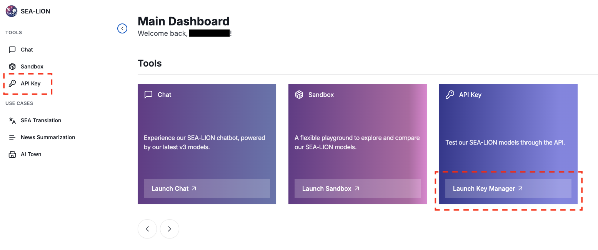

# SEA-LION API


The SEA-LION API provides a quick and simple interface to our various SEA-LION models for text generation, translation, summarization, and more. 

### Getting an API Key

To get started with SEA-LION API, you'll need to first create an API key via our [SEA-LION Playground](https://playground.sea-lion.ai/):

1. Sign in to SEA-LION Playground via your Google account

2. Navigate to our API Key Manager page by clicking on Settings -> API Key



3. Click on the "Create New Trial API Key" button, and enter a name for your API key.


An API key will be generated for you after you click "Create". **Make sure to copy or download the generated key** and keep it in a safe place since you won't be able to view it again. 


Only 1 API key is allowed to be created per user.

### How To Use Your API Key

#### Step 1. Find the Available Models

To find the available SEA-LION models for your API key, use the following curl command.

```
curl 'https://api.sea-lion.ai/v1/models' \
  -H 'Authorization: Bearer YOUR_API_KEY'
```
Replace YOUR_API_KEY with your generated API key.

#### Step 2: Call the API

SEA-LION's API endpoints for chat and embeddings are compatible with OpenAI's API and libraries.



 
```curl
curl -X 'POST' \
  https://api.sea-lion.ai/v1/chat/completions \
  -H 'accept: text/plain' \
  -H 'Authorization: Bearer YOUR_API_KEY' \
  -H 'Content-Type: application/json' \
  -d '{
    "max_completion_tokens": 20,
    "messages": [
      {
        "content": "What is Deep Learning?",
        "role": "user"
      }
    ],
    "model": "aisingapore/gemma2-9b-cpt-sea-lionv3-instruct"
  }'
```



```python
from openai import OpenAI
client = OpenAI()

completion = client.chat.completions.create(
    model="aisingapore/gemma2-9b-cpt-sea-lionv3-instruct",
    messages=[
        {
            "role": "user",
            "content": "What is Deep Learning"
        }
    ]
)

print(completion.choices[0].message.content)
```



<br>


