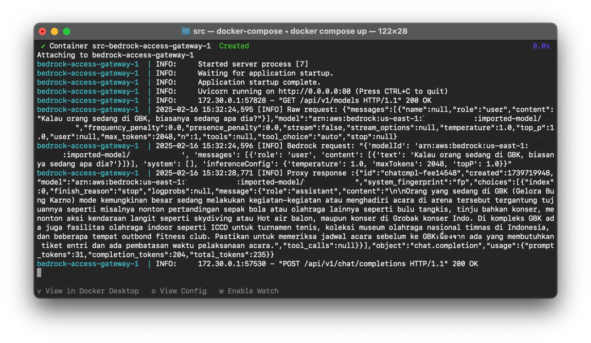
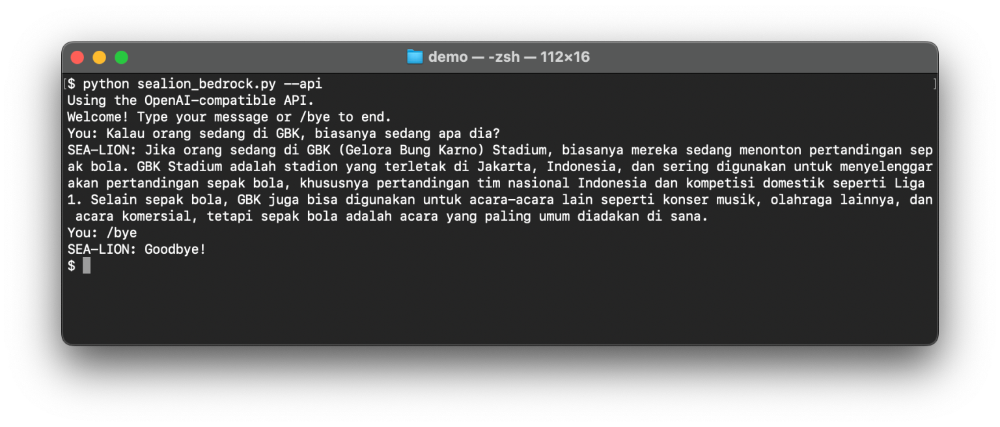

# OpenAI-compatible APIs with SEA-LION and Bedrock Access Gateway

In the [previous guide](./amazon_bedrock.md), we have shown how to leverage on Amazon Bedrock‘s Custom Model Import to deploy SEA-LION on the cloud. After importing the SEA-LION models, you can build applications with the AWS SDK. This article describes an alternative method to build the applications with OpenAI-compatible APIs served by the **Bedrock Access Gateway**.

<figure></figure>

## Prerequisites

The SEA-LION model is [imported](https://docs.aws.amazon.com/bedrock/latest/userguide/model-customization-import-model.html) and available on Amazon Bedrock. For imported models, you are charged for model inference. Please refer to the [Amazon Bedrock Pricing](https://aws.amazon.com/bedrock/pricing/) page for the latest information.

Please check that the following are installed on your development machine.

- [Git](https://git-scm.com/downloads)
- [Python](https://www.python.org/downloads/)

## Local Installation

If you have already cloned the [https://github.com/aisingapore/bedrock-access-gateway](https://github.com/aisingapore/bedrock-access-gateway) repository from the previous [guide](./amazon_bedrock.md), skip to the next step. The repository is a fork to support the imported models. At the time of writing, the original repository supports [foundation models](https://docs.aws.amazon.com/bedrock/latest/userguide/models-supported.html) only.

```bash
git clone https://github.com/aisingapore/bedrock-access-gateway.git
```

Navigate to the src directory.

```bash
cd bedrock-access-gateway/src
```

Check the [access keys](https://docs.aws.amazon.com/sdkref/latest/guide/feature-static-credentials.html) and environment variables. Please ensure that `AWS_REGION` is set to the region where the model is imported.

- `AWS_ACCESS_KEY_ID`
- `AWS_SECRET_ACCESS_KEY`
- `AWS_SESSION_TOKEN`
- `AWS_REGION`

### Run with Uvicorn

Before running the gateway, it is a good practice to create a virtual environment to isolate the app. Please follow these steps to create a virtual environment, or feel free to use your preferred tool.

Initialise the virtual environment.

```bash
python -m venv venv
```

Activate the virtual environment.

```bash
source venv/bin/activate
```

Install the packages.

```bash
pip install -r requirements.txt
```

Start the gateway.

```bash
uvicorn api.app:app --host 0.0.0.0 --port 8000
```

### Run with Docker Compose

Alternatively, start the gateway with Docker Compose if it is installed.

```bash
docker compose up
```

## Test the APIs

List the models with the following curl script. The imported model is in the list with the format `arn:aws:bedrock:<AWS_REGION>:<ACCOUNT_ID>:imported-model/<MODEL_ID>`

```bash
curl http://localhost:8000/api/v1/models -H "Authorization: Bearer bedrock"
```

Test the chat completion API with the following curl script. Replace `<AWS_REGION>`, `<ACCOUNT_ID>` and `<MODEL_ID>` with the values from the imported model’s ARN (Amazon Resource Name) from the model list.

```bash
curl http://localhost:8000/api/v1/chat/completions \
-H "Content-Type: application/json" \
-H "Authorization: Bearer bedrock" \
-d '{
  "model": "arn:aws:bedrock:<AWS_REGION>:<ACCOUNT_ID>:imported-model/<MODEL_ID>",
  "messages": [
    {
      "role": "user",
      "content": "Kalau orang sedang di GBK, biasanya sedang apa dia?"
    }
  ]
}'
```

## Demo

With the gateway, the demo from the previous [guide](./amazon_bedrock.md) can use the [Python library for OpenAI API](https://pypi.org/project/openai/) to integrate with the imported model. Follow the steps in the post to set it up. Run the demo with the `--api` parameter.

```bash
python sealion_bedrock.py --api
```

<figure></figure>

## Links

- SEA-LION Models on Hugging Face: [https://huggingface.co/aisingapore](https://huggingface.co/aisingapore)
- Bedrock Access Gateway: [https://github.com/aisingapore/bedrock-access-gateway](https://github.com/aisingapore/bedrock-access-gateway)
  - Production deployment: [https://github.com/aisingapore/bedrock-access-gateway?tab=readme-ov-file#deployment](https://github.com/aisingapore/bedrock-access-gateway?tab=readme-ov-file#deployment)