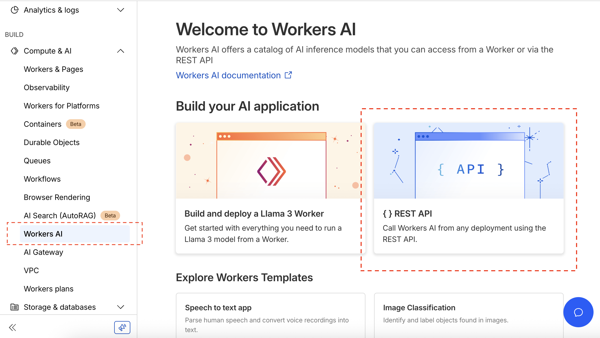

# SEA-LION via Cloudflare Workers AI

Our Gemma-SEALION-v4-27B-IT model is now supported on the Cloudflare Workers AI for on-demand inferencing, subject to Cloudflare's [Data Usage](https://developers.cloudflare.com/workers-ai/platform/data-usage/) and [Pricing Plans](https://developers.cloudflare.com/workers-ai/platform/pricing/).

This quickstart guide will instruct you through setting up your Workers AI account and REST API to easily experiment with Gemma-SEALION-v4-27B-IT. For more detailed information, you can refer directly to the latest guide on Cloudflare [here](https://developers.cloudflare.com/workers-ai/models/gemma-sea-lion-v4-27b-it/)


### Step 1. Create a Cloudflare Account
Sign up for a [Cloudflare account](https://dash.cloudflare.com/sign-up/workers-and-pages) if you have not already done so.

### Step 2. Get Cloudflare API token and Account ID
You need your API token and Account ID to use the REST API.

To get these values:
- In the Cloudflare dashboard, go to the `Workers AI` page and select `REST API`:
<figure></figure>

- Get your API token:
  - Select Create a Workers AI API Token.
  - Review the prefilled information.
  - Select Create API Token.
  - Select Copy API Token.
  - Save that value for future use.

- For Get Account ID, copy the value for Account ID. Save that value for future use.

### 3. Run Gemma-SEALION-v4-27B-IT via Cloudflare Workers AI API

After creating your API token, authenticate and make requests to the Worker AI API using your API token in the request.


 
```
curl https://api.cloudflare.com/client/v4/accounts/{$CLOUDFLARE_ACCOUNT_ID}/ai/run/@cf/aisingapore/gemma-sea-lion-v4-27b-it \
  -X POST \
  -H 'Authorization: Bearer {$CLOUDFLARE_AUTH_TOKEN}' \
  -d '{ 
    "messages": [
        { 
            "role": "system", 
            "content": "You are a friendly assistant" 
        }, 
        { 
            "role": "user", 
            "content": "Tell me a Singlish joke!" 
        }
    ],
    "stream": false
    }'
```



```python
import os
import requests

ACCOUNT_ID = os.environ.get("CLOUDFLARE_ACCOUNT_ID")
AUTH_TOKEN = os.environ.get("CLOUDFLARE_AUTH_TOKEN")

prompt = "Tell me a Singlish joke"
response = requests.post(
  f"https://api.cloudflare.com/client/v4/accounts/{ACCOUNT_ID}/ai/run/@cf/aisingapore/gemma-sea-lion-v4-27b-it",
    headers={"Authorization": f"Bearer {AUTH_TOKEN}"},
    json={
      "messages": [
        {"role": "system", "content": "You are a friendly assistant"},
        {"role": "user", "content": prompt}
      ]
    }
)
completion = response.json()
print(completion["result"]["choices"][0]["message"]["content"])
```




Cloudflare also supports OpenAI compatible endpoints for text generation (/v1/chat/completions) 


 
```
curl --request POST \
  --url https://api.cloudflare.com/client/v4/accounts/{$CLOUDFLARE_ACCOUNT_ID}/ai/v1/chat/completions \
  -H 'Authorization: Bearer {$CLOUDFLARE_AUTH_TOKEN}' \
  -H 'Content-Type: application/json' \
  -d '
    {
      "model": "@cf/aisingapore/gemma-sea-lion-v4-27b-it",
      "messages": [
        {
          "role": "user",
          "content": "Tell me a Singlish joke"
        }
      ]
    }'
```



```python
from openai import OpenAI

ACCOUNT_ID = os.environ.get("CLOUDFLARE_ACCOUNT_ID")
AUTH_TOKEN = os.environ.get("CLOUDFLARE_AUTH_TOKEN")

client = OpenAI(
    api_key=AUTH_TOKEN,
    base_url=f"https://api.cloudflare.com/client/v4/accounts/{ACCOUNT_ID}/ai/v1" 
)

completion = client.chat.completions.create(
    model="@cf/aisingapore/gemma-sea-lion-v4-27b-it",
    messages=[
        {
            "role": "user",
            "content": "Tell me a Singlish joke!"
        }
    ]
)

print(completion.choices[0].message.content)
```

