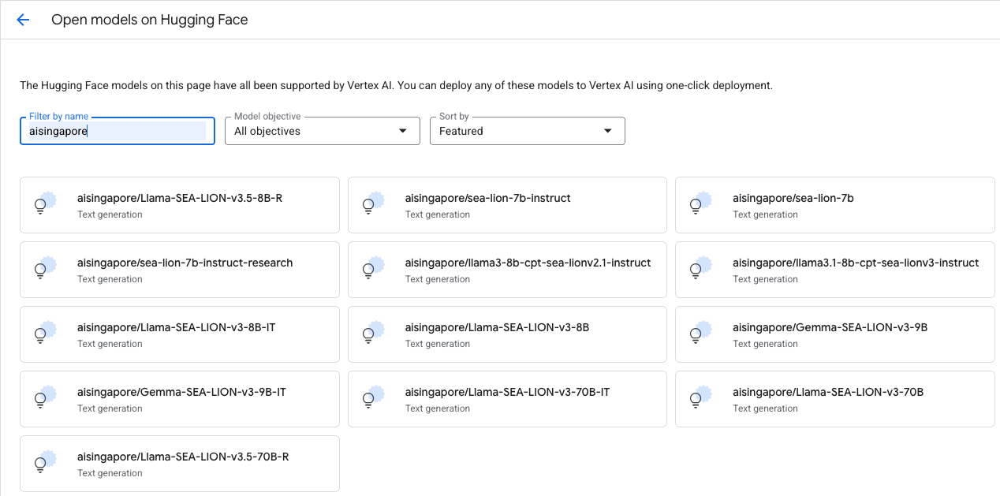
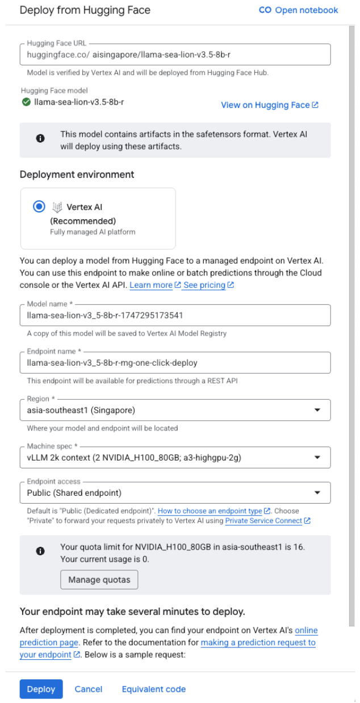
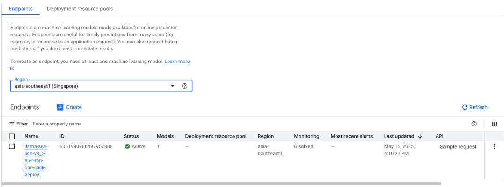

# Deploy SEA-LION to Google's Vertex AI

A step-by-step guide to deploying AI Singapore's SEA-LION models to run as an endpoint on Google's Vertex AI.

1. Go to Google's [Model Garden](https://console.cloud.google.com/vertex-ai/model-garden)

2. Scroll down (in the main page) to the "All Partners" section, and click on "Hugging Face".

3. Set the “Filter by Name” to “aisingapore”. A list of SEA-LION models will appear.

<figure></figure>

4. Click the model you wish to deploy, and a side panel will pop up. Here you
can set the name of your endpoint, select the region and machine spec to deploy
the model to. Then click on Deploy to complete the deployment.

    (Note: make sure you have enough hardware quota in your selected region)

<figure></figure>

5. The deployment takes some time (depending on the size of the model). When done, you will see the deployed endpoint in your [Endpoints page](https://console.cloud.google.com/vertex-ai/endpoints)

    Take note of your endpoint ID.

<figure></figure>

6. To test your deployed endpoint using a Python program,

    a. Get a Vertex AI service key from your administrator, or create one
    yourself if you have the right permissions on GCP.

    b. Install the [Google Cloud SDK](https://cloud.google.com/sdk/docs/install)
    for your system.

    c. Make sure your Google Cloud SDK is properly installed and authenticated
    by running the following command: `gcloud auth login`

    d. Create a new Python environment and install the following packages:
    `pip install google-cloud-aiplatform openai`

7. Create a Python program like the following:

```
import openai
import os
from google.auth import default
import google.auth.transport.requests

# Set the path to your service account key file
os.environ['GOOGLE_APPLICATION_CREDENTIALS'] = 'vt-svc-key.json'

PROJECT_ID = "<your GCP project ID>"
LOCATION = "<region of your deployed endpoint>"
ENDPOINT = "Your endpoint ID (from the above screenshot)"

# Get access token
# Note: the credential lives for 1 hour by default, and must be refreshed after expiration
# (https://cloud.google.com/docs/authentication/token-types#at-lifetime);

credentials, _ = default(scopes=["https://www.googleapis.com/auth/cloud-platform"])
credentials.refresh(google.auth.transport.requests.Request())

client = openai.OpenAI(
    base_url = f"https://{LOCATION}-aiplatform.googleapis.com/v1/projects/{PROJECT_ID}/locatio ns/{LOCATION}/endpoints/{ENDPOINT}",
    api_key = credentials.token,
)

msg = "Write me a 5-line limerick"
max_tokens = 500
stream = False

resp = client.chat.completions.create(
    model = "",
    messages = [ {"role": "user" , "content": msg} ],
    max_tokens = max_tokens,
    stream = stream,
)
print(msg)
print(resp.choices[0].message.content)
```

8. Make sure your Vertex AI service key JSON file (named `vt-svc-key.json`) is
in the same directory as your Python program.

9. Run your program `python vt-test.py` and see the result:

```
❯ python vt-test.py
Write me a 5-line limerick
There once was a fellow so bright,
Whose knowledge shone with great might.
In the city so grand,
He solved problems with hand,
And his name echoed day and night.
```

