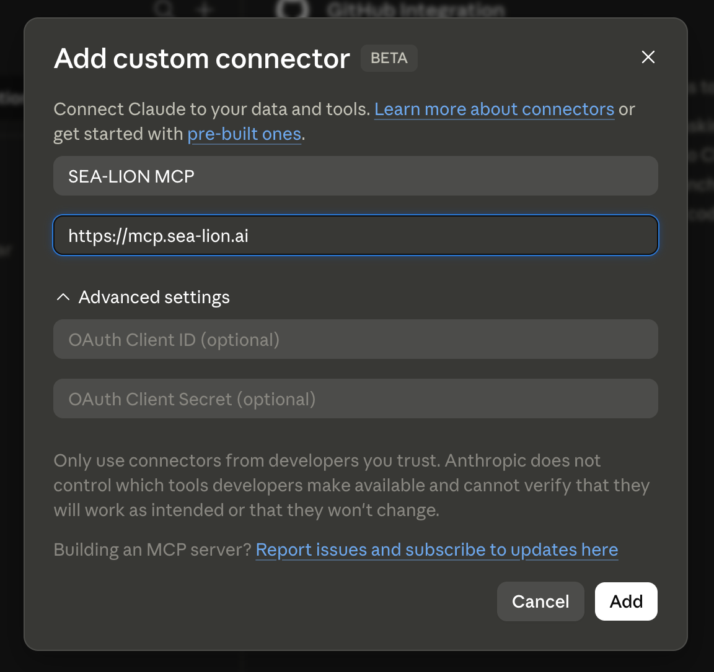
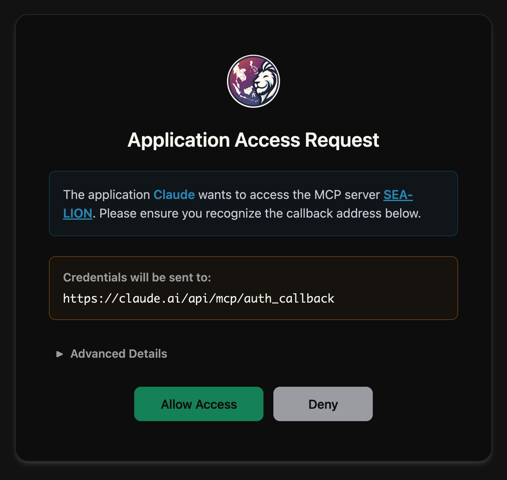
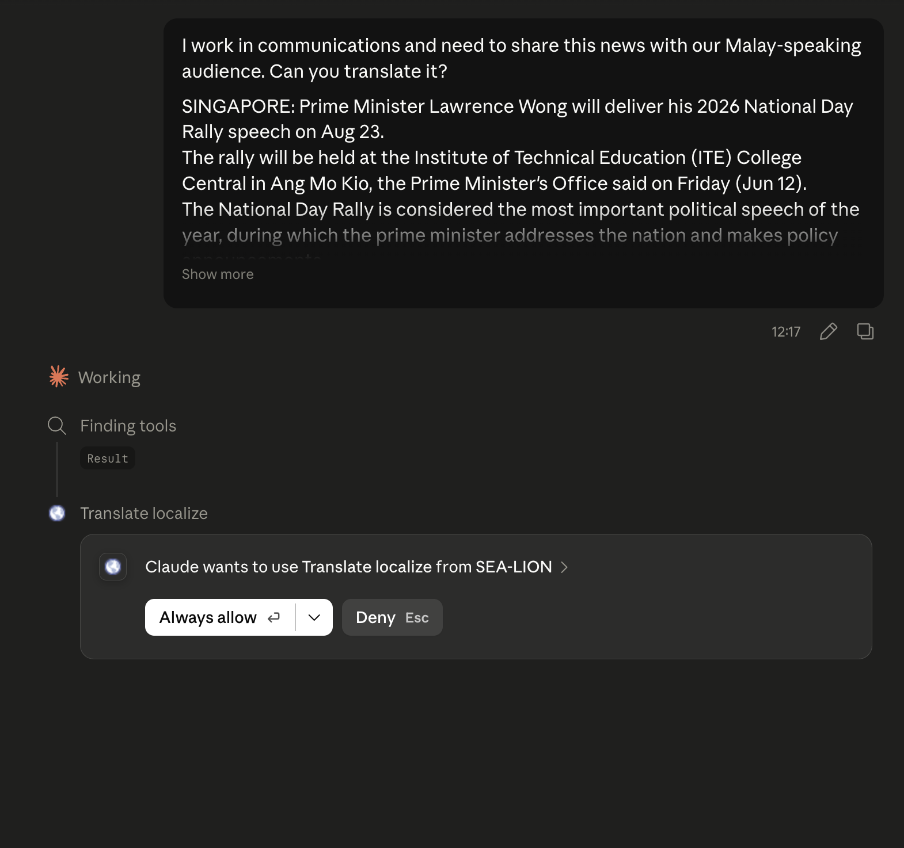
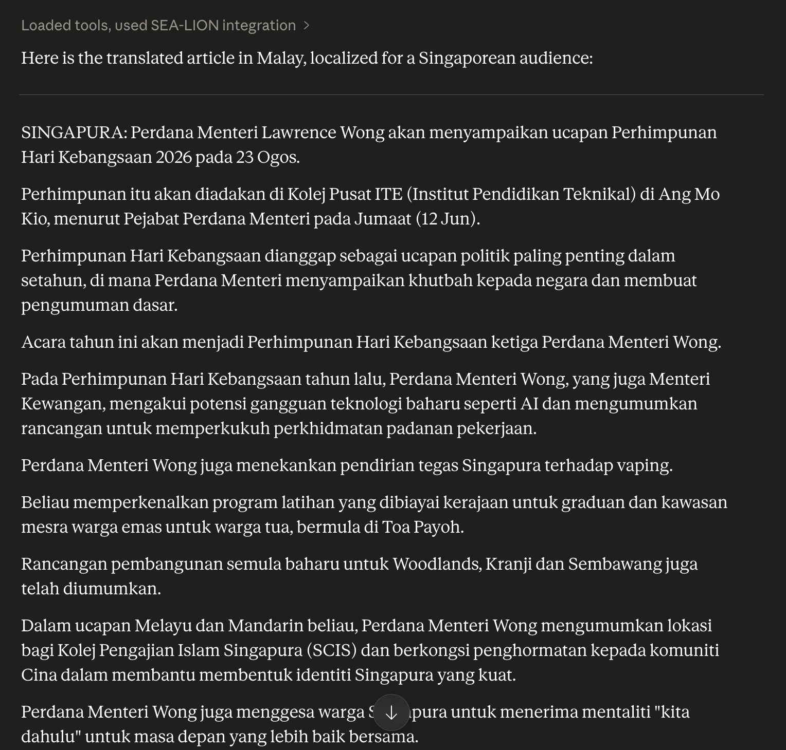

# SEA-LION Model Context Protocol Server

SEA-LION Model Context Protocol (MCP) Server provides a simple way to access SEA-LION’s multilingual models and Southeast Asian language tools from MCP-compatible clients.

The Model Context Protocol (MCP) is an open standard for connecting AI models to external tools, data sources, and services. It defines a common interface so that clients (such as IDEs, chat assistants, or AI agents) can discover and use capabilities provided by servers without custom integrations for each tool. Powered by the SEA-LION API, the MCP server exposes capabilities including translation and localisation, and safety classification.

Usage of the SEA-LION API is subject to our [Terms of Use](https://sea-lion.ai/terms-of-use/) and [Privacy Policy](https://sea-lion.ai/privacy-policy/)

## **Connect via Claude Desktop**

Claude Desktop handles the OAuth flow for you automatically. It's the most straightforward way to connect.

1. Open Claude Desktop and go to **Settings → Connectors → Customize**
2. Click Add Custom Connector and select Web
3. Enter a name (e.g. SEA-LION MCP) and the URL: <https://mcp.sea-lion.ai>
4. Click Add and Connect

<figure></figure>

5. Click on **Allow Access** and sign in with your Google account

<figure></figure>

## Connect via Claude Code CLI

To add the MCP server to Claude Code CLI:

```bash
claude mcp add --transport http sealion https://mcp.sea-lion.ai/
```

You'll then be prompted to sign in: your browser opens, and you authorise access with your Google account.

Verify the connection with:

```bash
claude mcp list
```

You should see `sealion` listed as ✓ Connected.

## Using Claude

Once integrated, SEA-LION MCP works invisibly in the background. Users can simply talk to the main LLM such as Claude naturally.

**Example Prompt:**

Can you translate this article into Malay for our Singapore audience?

<figure></figure>

<figure></figure>

Claude automatically calls SEA-LION's translation engine, localising the content for the right tone and context.

Beyond translation, SEA-LION can also detect Southeast Asian language variants and moderate content with cultural context specific to the region.

## Rate Limits

Limits help us mitigate misuse and manage API capacity and help ensure that everyone has fair access to the API.

SEA-LION MCP usage frequency will be subject to rate limits applied on requests per minute (RPM).

As of 04 Jun 2026, our rate limits is set to **10 requests per minute per user**.

If you have any questions or want to speak about getting a rate limit increase, reach out to [sealion@aisingapore.org](mailto:sealion@aisingapore.org).