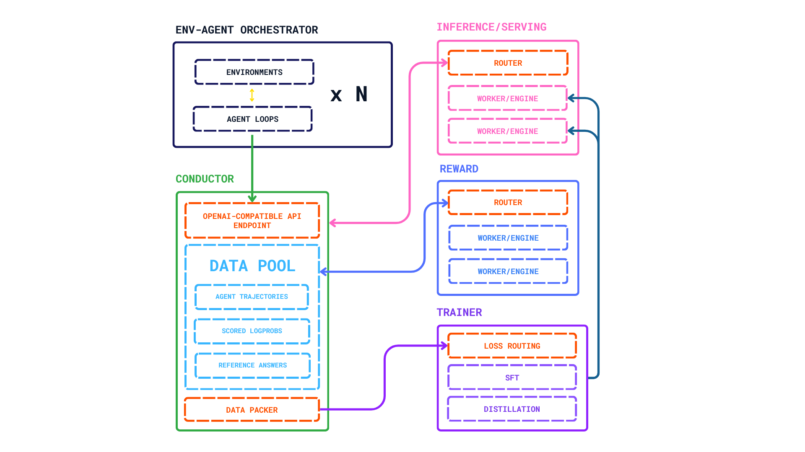

# Nemotron-SEA-LION-v4.8

*Last update: 2026-09-18*

**SEA-LION** is a collection of Large Language Models (LLMs) which have been pretrained and instruct-tuned for the Southeast Asia (SEA) region. **Nemotron-SEA-LION-v4.8-30B-A3B-Base** built upon the nvidia/NVIDIA-Nemotron-3-Nano-30B-A3B-Base-BF16 architecture. NVIDIA-Nemotron-3-Nano-30B-A3B-Base-BF16 is a 30-billion parameter base large language model with 3 billion active parameters, built on a Mamba2-Transformer Hybrid Mixture of Experts (MoE) architecture. The model underwent continued pre-training on 150B high-quality tokens across QA, reasoning, code, and translation data using [Megatron Bridge](https://github.com/NVIDIA-NeMo/Megatron-Bridge).

**Nemotron-SEA-LION-v4.8-30B-A3B** built upon the nvidia/NVIDIA-Nemotron-3-Nano-30B-A3B-Base-BF16 architecture. NVIDIA-Nemotron-3-Nano-30B-A3B-Base-BF16 is a 30-billion parameter base large language model with 3 billion active parameters. The Nemotron-SEA-LION-v4.8-30B-A3B-Base was fine-tuned with online on-policy distillation (OPD).

**Nemotron-SEA-LION-v4.8-120B-A12B-Base** built upon the nvidia/NVIDIA-Nemotron-3-Super-120B-A12B-BF16 architecture. NVIDIA-Nemotron-3-Super-120B-A12B-BF16 is a large language model trained by NVIDIA, featuring a hybrid LatentMoE architecture with interleaved Mamba-2, MoE, and Attention layers, plus Multi-Token Prediction (MTP). This model has 120B total parameters (12B active), supports up to 128k token context, and is optimized for agentic workflows, long-context reasoning, and high-volume workloads. The model underwent continued pre-training on 150B high-quality tokens across QA, reasoning, code, and translation data using [Automodel](https://github.com/NVIDIA-NeMo/Automodel).

**Nemotron-SEA-LION-v4.8-120B-A12B** built upon the nvidia/NVIDIA-Nemotron-3-Nano-120B-A12B-Base-BF16 architecture. NVIDIA-Nemotron-3-Nano-120B-A12B-Base-BF16 is a 120-billion parameter base large language model with 12 billion active parameters. Nemotron-SEA-LION-v4.8-120B-A12B-Base was fine-tuned with online on-policy distillation (OPD).

## Model Details

### Model Description

SEA-LION stands for Southeast Asian Languages In One Network.

We performed CPT in English and SEA languages on nvidia/NVIDIA-Nemotron-3-Nano-30B-A3B-Base-BF16, a text generation model using the nvidia/NVIDIA-Nemotron-3-Nano-30B-A3B-Base-BF16 architecture, to create Nemotron-SEA-LION-v4.8-30B-A3B-Base.

For tokenization, the model employs the default tokenizer used in nvidia/NVIDIA-Nemotron-3-Nano-30B-A3B-Base-BF16.

- **Developed by:** AI Products Pillar, AI Singapore
- **Funded by:** Singapore NRF
- **Shared by:** AI Products Pillar, AI Singapore
- **Model type:** Base LLM (Mamba2-Transformer Hybrid MoE)
- **Context Length:** 8K (Base model), 128K 
- **Language(s):** Balinese, Burmese, English, Indonesian, Javanese, Khmer, Lao, Malay, Mandarin, Sundanese, Tamil, Thai, and Vietnamese
- **License:** [Other](https://huggingface.co/aisingapore/Nemotron-SEA-LION-v4.8-30B-A3B-Base/blob/main/NOTICE.md)
- **Finetuned from model:** [nvidia/NVIDIA-Nemotron-3-Nano-30B-A3B-Base-BF16](https://huggingface.co/nvidia/NVIDIA-Nemotron-3-Nano-30B-A3B-Base-BF16)

### Model Sources

- **Repository:** [SEA-LION v4.8 - an aisingapore Collection](https://huggingface.co/collections/aisingapore/sea-lion-v48)

## Training Details

### Training Data for Base model

The continued pretraining dataset comprised 150B tokens on QA, CoT, Reasoning and parallel (translation) datasets adapted from

- [AI-MO/NuminaMath-CoT](https://huggingface.co/datasets/AI-MO/NuminaMath-CoT)
- [aisingapore/SEA-Instruct-2602](https://huggingface.co/datasets/aisingapore/SEA-Instruct-2602)
- [HuggingFaceFW/finetranslations-edu](https://huggingface.co/datasets/HuggingFaceFW/finetranslations-edu)
- [jhu-clsp/megawika-2](https://huggingface.co/datasets/jhu-clsp/megawika-2)
- [nvidia/Nemotron-SFT-OpenCode-v1](https://huggingface.co/datasets/nvidia/Nemotron-SFT-OpenCode-v1)
- [nvidia/Nemotron-SFT-SWE-v2](https://huggingface.co/datasets/nvidia/Nemotron-SFT-SWE-v2)
- [nvidia/Nemotron-SFT-Agentic-v2](https://huggingface.co/datasets/nvidia/Nemotron-SFT-Agentic-v2)
- [nvidia/Nemotron-SFT-Competitive-Programming-v2](https://huggingface.co/datasets/nvidia/Nemotron-SFT-Competitive-Programming-v2)
- [nvidia/Nemotron-SFT-Math-v3](https://huggingface.co/datasets/nvidia/Nemotron-SFT-Math-v3)
- [nvidia/OpenMathInstruct-2](https://huggingface.co/datasets/nvidia/OpenMathInstruct-2)
- [nvidia/OpenScienceReasoning-2](https://huggingface.co/datasets/nvidia/OpenScienceReasoning-2)
- [KingNish/reasoning-base-20k](https://huggingface.co/datasets/KingNish/reasoning-base-20k)
- [ZombitX64/Medical-o1-Reasoning-SFT-Thai](https://huggingface.co/datasets/ZombitX64/Medical-o1-Reasoning-SFT-Thai)

### Training Regime for Base model

Our continue pretraining workflow focused on parallel-only dataset for better multilingual and cross-lingual performance running on [Megatron Bridge](https://github.com/NVIDIA-NeMo/Megatron-Bridge).

### Training Data for On-Policy Distillation

The data are generated and consumed continuously through a collection of heterogeneous tasks and agent harnesses. The training data is a subset of [aisingapore/SEA-Instruct-2602](https://huggingface.co/datasets/aisingapore/SEA-Instruct-2602).

### Training Regime for On-Policy Distillation



### Results

For details on Nemotron-SEA-LION-v4.8 performance, please refer to the [SEA-LION Leaderboard](https://leaderboard.sea-lion.ai/).

## Technical Specifications

### Model Architecture

The architecture is based on the highly efficient Nemotron-3-Super foundation. The detailed architecture can be found at [nvidia/NVIDIA-Nemotron-3-Super-30B-A3B-Base-BF16 documentation](https://research.nvidia.com/labs/nemotron/files/NVIDIA-Nemotron-3-Super-Technical-Report.pdf). and 
[nvidia/NVIDIA-Nemotron-3-Nano-30B-A3B-Base-BF16 documentation](https://research.nvidia.com/labs/nemotron/files/NVIDIA-Nemotron-3-Nano-Technical-Report.pdf).

## How to Get Started with the Model

Use the code below to get started with the model with 🤗 Transformers libraries.

```
from transformers import AutoTokenizer, AutoModelForCausalLM
import torch
model_name = "aisingapore/Nemotron-SEA-LION-v4.8-30B-A3B"
tokenizer = AutoTokenizer.from_pretrained(model_name)
model = AutoModelForCausalLM.from_pretrained(
    model_name,
    torch_dtype=torch.bfloat16,
    trust_remote_code=True,
    device_map="auto"
)
messages = [
    {"role": "user", "content": "What is Nasi goreng?"},
]
tokenized_chat = tokenizer.apply_chat_template(
    messages,
    tokenize=True,
    add_generation_prompt=True,
    return_tensors="pt"
).to(model.device)
if not isinstance(tokenized_chat, torch.Tensor):
    input_ids = tokenized_chat["input_ids"]
else:
    input_ids = tokenized_chat
outputs = model.generate(
    input_ids,
    max_new_tokens=50,
    temperature=1.0,
    top_p=0.95,
    eos_token_id=tokenizer.eos_token_id
)
print(tokenizer.decode(outputs[0]))
```

# Available Quantized Versions

We provide multiple quantization formats to optimize deployment trade-offs between memory footprint and output quality.

- [Nemotron-SEA-LION-v4.8-30B-A3B-NVFP4](https://huggingface.co/aisingapore/Nemotron-SEA-LION-v4.8-30B-A3B-NVFP4) 
- [Nemotron-SEA-LION-v4.8-30B-A3B-FP8](https://huggingface.co/aisingapore/Nemotron-SEA-LION-v4.8-30B-A3B-FP8)
- [Nemotron-SEA-LION-v4.8-30B-A3B-GGUF](https://huggingface.co/aisingapore/Nemotron-SEA-LION-v4.8-30B-A3B-GGUF)
- [Nemotron-SEA-LION-v4.8-120B-A12B-NVFP4](https://huggingface.co/aisingapore/Nemotron-SEA-LION-v4.8-120B-A12B-NVFP4)
- [Nemotron-SEA-LION-v4.8-120B-A12B-FP8](https://huggingface.co/aisingapore/Nemotron-SEA-LION-v4.8-120B-A12B-FP8)
- [Nemotron-SEA-LION-v4.8-120B-A12B-GGUF](https://huggingface.co/aisingapore/Nemotron-SEA-LION-v4.8-120B-A12B-GGUF)

Model Weights included in each GGUF repository:
- Q4_K_M [120B-A12B](./Nemotron-SEA-LION-v4.8-120B-A12B-Q4_K_M.gguf), [30B-A3B](./Nemotron-SEA-LION-v4.8-30B-A3B-Q4_K_M.gguf)
- Q6_K [120B-A12B](./Nemotron-SEA-LION-v4.8-120B-A12B-Q6_K.gguf), [30B-A3B](./Nemotron-SEA-LION-v4.8-30B-A3B-Q6_K.gguf)
- Q8_0 [120B-A12B](./Nemotron-SEA-LION-v4.8-120B-A12B-Q8_0.gguf), [30B-A3B](./Nemotron-SEA-LION-v4.8-30B-A3B-Q8_0.gguf)
- F16 [120B-A12B](./Nemotron-SEA-LION-v4.8-120B-A12B-F16.gguf), [30B-A3B](./Nemotron-SEA-LION-v4.8-30B-A3B-F16.gguf)

### Throughput Test

Each checkpoint was served with vLLM on NVIDIA H200 GPUs and benchmarked over the OpenAI-compatible chat endpoint with GuideLLM, an open-source throughput benchmark from the [vLLM](https://github.com/vllm-project/guidellm) project. 

The prompts are our own Southeast Asian instructions from the SEA-instruct dataset, streamed with a fixed output length per request so that every checkpoint generates the same number of tokens. 

Time to first token is the time taken from sending the request until the first content token arrives, so it covers prompt processing (prefill) and network overhead on localhost. 
Tokens per second is a metric that measures the number of output tokens divided by that request's total time from send to final token. 
Both are reported as mean ± standard deviation over all requests completed in a 120-second run. 
The VRAM Usage is taken from vLLM upon loading.

| Model Variant | Number of GPUs | Actual VRAM Usage (GB) | Time to First Token (s) | Tokens per Second |
| --- | --- | --- | --- | --- |
| 30B-A3B(BF16) | 1x H200 GPU(s) | 63.3 GB | 0.0456 | 311.10 ± 25.12 |
| 30B-A3B-FP8 | 1x H200 GPU(s) | 33.4 GB | 0.0350 | 365.18 ± 31.50 |
| 30B-A3B-NVFP4 | 1x H200 GPU(s) | 20.5 GB | 0.0339 | 340.29 ± 8.68 |
| 120B-A12B(BF16) | 2x H200 GPU(s) | 242.5 GB | 0.0936 | 150.31 ± 12.80 |
| 120B-A12B-FP8 | 2x H200 GPU(s) | 128.6 GB | 0.0449 | 161.36 ± 3.05 |
| 120B-A12B-NVFP4 | 2x H200 GPU(s) | 80.4 GB | 0.0446 | 156.36 ± 2.64 |

*Note: Benchmarks were captured on Hopper architecture (NVIDIA H200) GPUs; NVFP4 precision formats yield further hardware-level acceleration when executed natively on NVIDIA Blackwell infrastructure.*

All models were served at their full context length of 262,144 tokens with default vLLM settings. The tokens per second are reported as the aggregate across the GPUs used. 

FP8 checkpoints are a good default for reduced-precision deployment. NVFP4 checkpoints offer a 4-bit alternative designed for NVIDIA's Blackwell architecture. 

The figures reflect Hopper execution, and the checkpoints have not yet been benchmarked on Blackwell. We recommend measuring on your own workload before choosing a format.

### Recommended Usage

We recommend the FP8 static checkpoint as the default for both model sizes. It is the fastest format we ship, exceeding BF16 in both throughput and latency, and it matches BF16 within noise on SEA-HELM. The 30B fits on a single 40 GB GPU on a single H200. FP8 is also our recommended format for long-prompt, retrieval-style workloads.

NVFP4 is the option when memory is the binding constraint on NVIDIA hardware. It has the smallest footprint of our formats, at a small quality cost relative to FP8. As it is specifically optimized for Blackwell GPUs, it is expected to run natively as W4A4, though we have not benchmarked this yet.

INT4 GPTQ is intended for portability: Ampere GPUs and non-NVIDIA vLLM backends where FP8 and NVFP4 kernels are unavailable, or deployments where download size is the priority. It carries a larger quality gap than the other formats, so we suggest it only where the hardware leaves no alternative.

## How to Get Started with a Quantized Model

### Using `vLLM`

You can serve the model using `vllm` [[link](https://docs.vllm.ai/en/stable/features/quantization/llm_compressor/fp8/#online-dynamic-quantization)]:

```
from vllm import LLM, SamplingParams
llm = LLM(
    model="aisingapore/Nemotron-SEA-LION-v4.8-120B-A12B-FP8",
    trust_remote_code=True,   # needed for Nemotron hybrid Mamba/MoE configs
    max_model_len=8192,       # lower this if you hit KV-cache OOM
)
messages = [
    {"role": "system", "content": "You are a helpful assistant."},
    {"role": "user", "content": "Where is Lau Pa Sat? Tell me in a single sentence."},
]
params = SamplingParams(temperature=0.7, top_p=0.9, max_tokens=512)
outputs = llm.chat(messages, params)
print(outputs[0].outputs[0].text)
```

### SGLang

You can serve the model using [SGLang](https://docs.sglang.io/docs/advanced_features/quantized_kv_cache):

```python
from sglang import Engine, SamplingParams
# SGLang natively detects the pre-quantized FP8 checkpoint
llm = Engine(
    model_path="aisingapore/Nemotron-SEA-LION-v4.8-120B-A12B-FP8",
    trust_remote_code=True,
)
messages = [
    {"role": "system", "content": "You are a helpful assistant."},
    {"role": "user", "content": "Where is Lau Pa Sat? Tell me in a single sentence."},
]
# Configure generation constraints
params = SamplingParams(temperature=0.7, top_p=0.9)
# Execute inference using the OpenAI-compatible chat message format
outputs = llm.chat(messages, params)
print(outputs["text"])
```

## Uses

### Out-of-Scope Use

The model has not been aligned for safety. Developers and users should perform their own safety fine-tuning and related security measures. In no event shall the authors be held liable for any claims, damages, or other liabilities arising from the use of the released weights and codes.

### Bias, Risks, and Limitations

The model was not tested for robustness against adversarial prompting. It is important for users to be aware that our model exhibits certain limitations that warrant consideration. Like many LLMs, the model can hallucinate and occasionally generates irrelevant content, introducing fictional elements that are not grounded in the provided context. Users should also exercise caution in interpreting and validating the model's responses due to the potential inconsistencies.

## Citation

**BibTeX:**

```bibtex
@misc{aisingapore2026sealionv48technicalreport,
      title={SEA-LION-v4.8: A Technical Report},
      author={Adila Aulia and Ahmed Dabeer and Ahn Jeongmi and Antonyrex Sajeban and Chan Hok Teng Adwin and Cheng Zi Yi Nicholas and Choa Hsueh Mei Esther and Heng Jonathan and Jann Railey Estrada Montalan and Lee Chwan Ren and Leong Wai Yi and Leong Wei Qi and Liew Rachel and Limkonchotiwat Peerat and Muhammad Ridzuan Bin Mokhtar and Nagarajan Karthik and Ng Boon Cheong Raymond and Ngee Chia Tai and Ngui Jian Gang and Nguyen Thanh Ngan and Ong Tat-Wee David and Pereira Mark and Phang Shi Wei Benjamin and Poon Joseph and Rengarajan Hamsawardhini and Susanto Yosephine and Sutaveephamochanon Anocha and Tan Choon Meng and Tan Chor Phin Evelyn and Tan Le Min Sheryl and Tan Siao Wei Jessica and Tan Yixian and Tasawong Panuthep and Tee Jun Yun and Teng Kok Wai Walter and Teo Eng Sipp Leslie and Tjhi William and Tuchinda Pume and Wu Donghang and Yong Xianbin and Zhang Zhou},
      year={2026},
      eprint={2609.18310},
      archivePrefix={arXiv},
      primaryClass={cs.CL},
      url={https://arxiv.org/abs/2609.18310},
}
```

